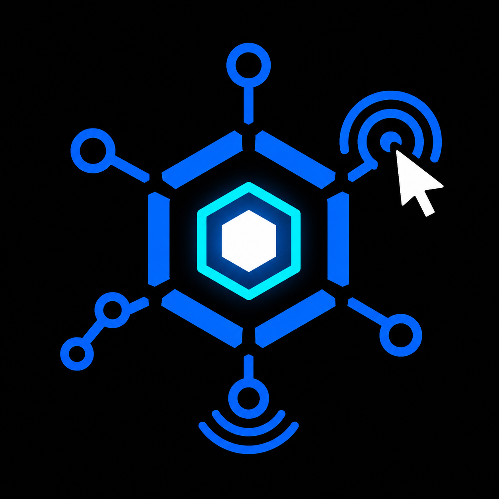
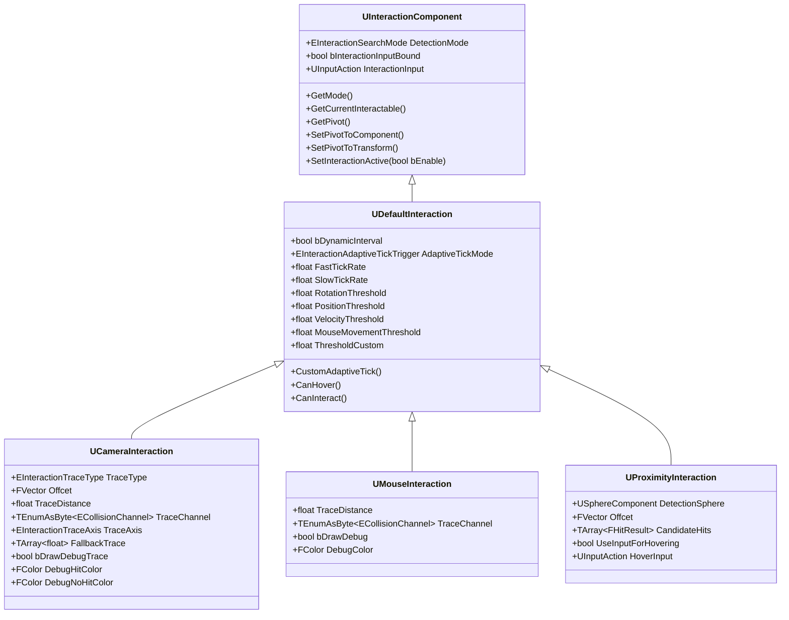
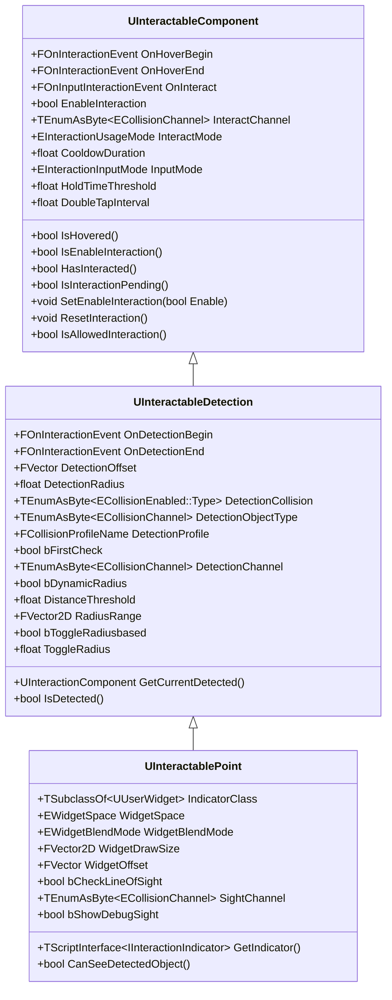

# InteractCore

<p align="center">
  
</p>

<p align="center">
  <b>A minimal, modular Interaction framework for Unreal Engine</b><br/>
  It gives you a ready-to-use system for hovering, detecting, and interacting with objects in first-person, third-person, isometric/top-down, and proximity-based games — built entirely on Unreal's **Enhanced Input** system and network-ready out of the box.
</p>

<p align="center">
  
  
  
</p>

---
## Overview

InteractCore is built around one simple idea:

> Everything that can be interacted with implements a common interface (`IInteractable`) and communicates through a central interaction component.

That keeps your interaction logic decoupled: the actor doing the interacting doesn't need to know what it's interacting with, and the interactable object doesn't need to know how it was detected (camera trace, mouse, or proximity).

## Architecture

The plugin is split into two component hierarchies plus a shared interface.

### Interaction side — lives on the "player" (the thing that interacts)

| Class | Responsibility |
|---|---|
| `UInteractionComponent` | Abstract base. Manages the interaction pivot, Enhanced Input binding, and the currently focused interactable. |
| `UDefaultInteraction` | Adds permission checks (`CanHover` / `CanInteract`) and an adaptive tick system for performance. |
| `UCameraInteraction` | Traces from the camera — for **FPS** games. |
| `UProximityInteraction` | Uses a detection sphere and optional hover input — for **TPS**/proximity-based games. |
| `UMouseInteraction` | Traces from the camera through the mouse cursor — for **Isometric/Top-Down** games. |



### Interactable side — lives on the object being interacted with

| Class | Responsibility |
|---|---|
| `UInteractableComponent` | Abstract base. A sphere collider that implements `IInteractable` and handles hover/interact state, cooldowns, and input mode (press, hold, tap, double-click, etc.). |
| `UInteractableDetection` | Adds a second, larger sphere used to detect an interactor *before* it's actually hovering — supports dynamic radius (lerps with distance) and toggled radius (changes on overlap). |
| `UInteractablePoint` | Adds a `UWidgetComponent` indicator with optional line-of-sight checking, so the prompt widget hides when the object is behind a wall. |



### `IInteractable` interface

The contract every interactable object implements:

- `Hover(Provider, Hit)` — called when an interaction provider starts hovering the object.
- `UnHover(Provider)` — called when it stops hovering.
- `Interact(Provider, Hit, InputInstance)` — called when the object is actually interacted with.
- `ShouldHandleInput(InputValue) const` — decides whether a given input action should count toward interaction (used to support press/hold/tap/double-click modes).

## Features

- **Flexible detection scope** — `DetectionMode` on `UInteractionComponent` lets a raycast hit resolve the `IInteractable` from the Actor, the Component, both, or Actor-first-with-component-fallback.
- **Enhanced Input native** — all interaction and hover input is bound through Unreal's Enhanced Input system.
- **Adaptive tick / performance optimization** — `UDefaultInteraction` can slow down its trace rate when idle and speed up based on camera rotation, position, owner velocity, mouse movement, or a fully custom rule (`CustomAdaptiveTick`).
- **Multiple detection strategies** — camera line/sphere trace with fallback radii (`UCameraInteraction`), mouse-to-world trace (`UMouseInteraction`), or overlap-sphere proximity (`UProximityInteraction`).
- **Dynamic detection radius** — `UInteractableDetection` can lerp its detection sphere radius based on player distance, or toggle to a different radius once a player overlaps it.
- **Rich input modes per interactable** — Press, Release, Tap, Hold, Charged Release, Double Click, or Any, plus `Once` / `Multi` / `Cooldown` usage modes.
- **Line-of-sight aware indicators** — `UInteractablePoint` hides its widget indicator when the object is detected but not actually visible (e.g. behind a wall).
- **Ready-made indicator widgets** — the plugin content includes default widgets for the built-in interaction/input types so you can get a working prompt UI immediately.
- **Blueprint-friendly** — every extension point (`CanHover`, `CanInteract`, `CustomAdaptiveTick`, `ApplyZoneSettings`, `ApplyWidgetSettings`) is exposed as a `BlueprintImplementableEvent`/`BlueprintNativeEvent` so you can override behavior without touching C++.

## Installation

1. Copy the `InteractCore` folder into your project's `Plugins` directory (create one if it doesn't exist).
2. Regenerate project files and rebuild, or simply relaunch the Unreal Editor.
3. Enable **InteractCore** in `Edit > Plugins` if it isn't enabled automatically.
4. The plugin depends on the **Enhanced Input** plugin, which is enabled automatically as a dependency.

## Getting Started (FPS example)

1. Add a `UCameraInteraction` component to your player character/controller and assign an `InteractionInput` (Input Action asset).
2. On any actor you want the player to be able to interact with:
   - Implement the `IInteractable` interface (or, more commonly, just add one of the built-in interactable components), **or**
   - Add a `UInteractablePoint` component, assign an indicator widget class (your own, or one of the plugin's defaults), and bind to its `OnHoverBegin` / `OnHoverEnd` / `OnInteract` events to drive your gameplay logic.

The same pattern applies for third-person/proximity setups using `UProximityInteraction`, and top-down/isometric setups using `UMouseInteraction` — only the "interaction" side component changes; the interactable side stays the same.

> **Note on input handling:** `ShouldHandleInput` on `IInteractable` is the key hook for input filtering — it receives the raw input action instance and returns whether this interactable should respond to it, which is how holding, double-tapping, etc. are supported without extra wiring on your part.

## Project Structure

```
InteractCore/
├── Content/                # Default indicator widgets & textures
├── Resources/               # Plugin icon
├── Source/InteractCore/
│   ├── Interaction/         # UInteractionComponent and its derived classes
│   ├── Interactable/        # UInteractableComponent and its derived classes
│   ├── Interface/            # IInteractable and IInteractionIndicator
│   ├── Widget/                # UInteractionIndicatorWidget base
│   ├── Engine/                # Debug helpers
│   └── Module/                # Plugin module entry point
└── InteractCore.uplugin
```

## Requirements

- Unreal Engine (C++ project)
- Enhanced Input plugin (bundled dependency, enabled automatically)

## License

See the [LICENSE](LICENSE) file for details.
