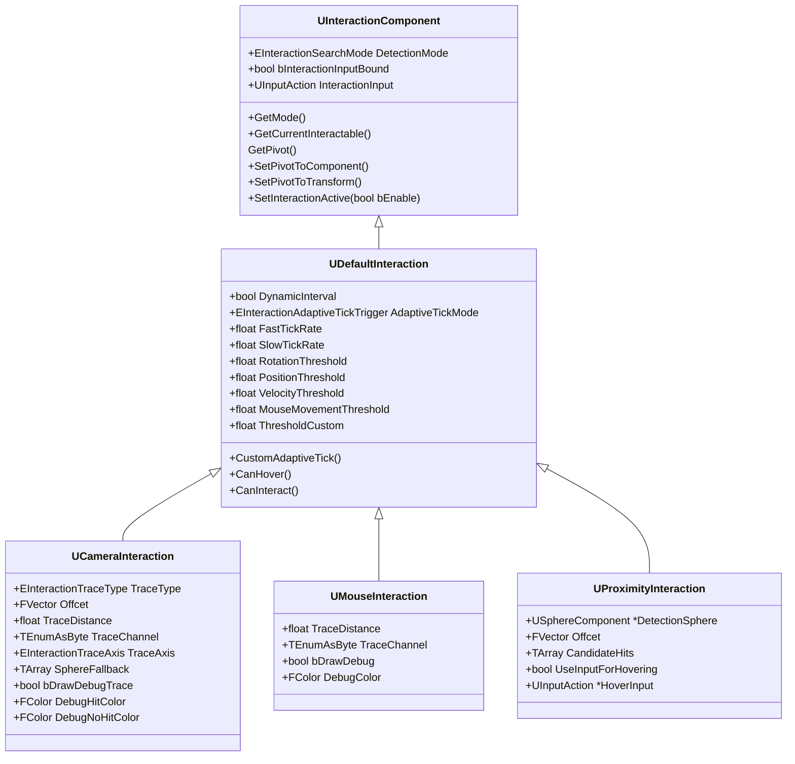
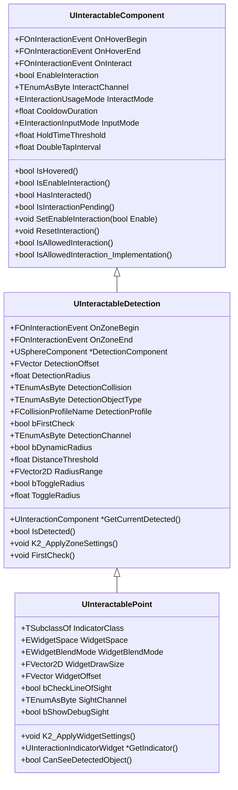

# InteractCore
 

`InteractCore` is a lightweight and extensible interaction framework designed for game development.

# Concept
`InteractCore` is built around a simple idea:
>"Everything that can be interacted with implements a common interface `(Interactable)` and communicates through a central interaction system.”

###### Structure
* `UInteractionComponent`: Is the main component for interaction (Input,Pivot)
    * `UDefaultInteraction`: Handel Optimization for raycast
        * `UCameraInteraction`:Handel Trace from camera for FPS game
        * `UProximityInteraction`: Handel trace and hovering with sphere for TPS game
        * `UMouseInteraction`: Handel trace from camera compatible with mouse for Isometric/TopDown game

* `UInteractableComponent`: Is the Sphere collider for Interaction
    * `UInteractableDetection`: Handel another sphere for detection befor hover
        * `UInteractablePoint`: Handel Indicator for Show Widget

* `IInteractable`: Base Interface for interaction indclude (hover,unhover,interact,ShouldHandleInput)

#### Interaction

#### Interactable

## Features
1. Interaction include `DetectionMode` to define after raycast check implementation interface in component or actor or both
2. Interaction include Settting part that define positon and direction and raycast type
3. Optimazation part for performace manageing by other paramter for tracing
4. Interaction just compatible with Unreal Inhance Input Systme
5. Interactable include Dynamic Raduis that lerp sphere raduis by player distance 
6. Interactable include ToogleDetection that use for change detection raduis after player overlap
7. Interactable component incdule predefina some type of interaction type (tap,hover,doubletap)
8. Interactable after detection can sight to agent for hide indicator if agent was behind wall
9. Basic Indicator with all of type interaction define as widget in plugin

## Getting Started (FPS)
1. Add `UCameraInteraction` in your player and set interaction input asset
2. In any actor you want player interact with that you can do
    A. Implement `IInteractable` Interface
    B. Add `UInteractablePoint` component in your actor and add Your Widget or plugin default widget to show indicator 
after that you shouw use Events in your actor

> `IInteractable` include important function that need for interaction  
`ShouldHandleInput` this function get input and return bool if true agent can interact you can control input type in that like holding , double_tap ...
